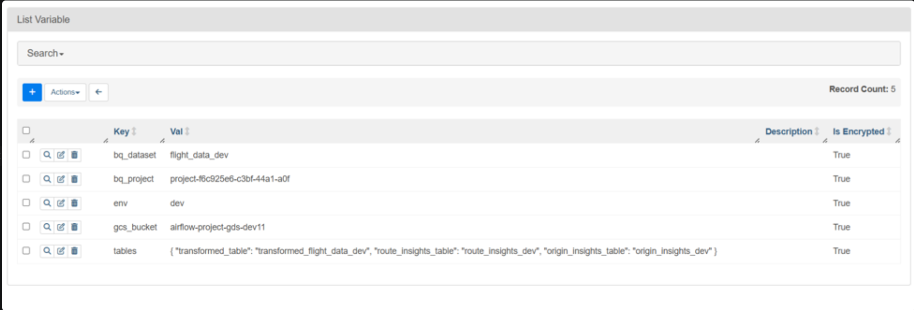
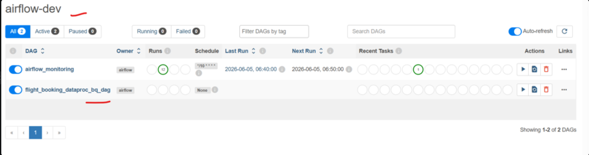
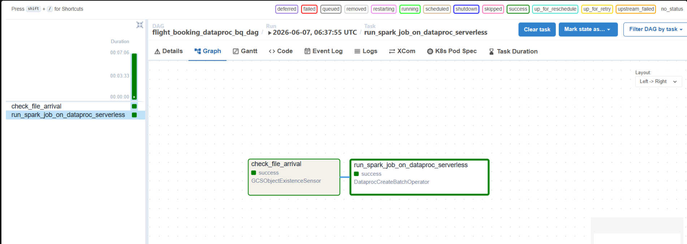
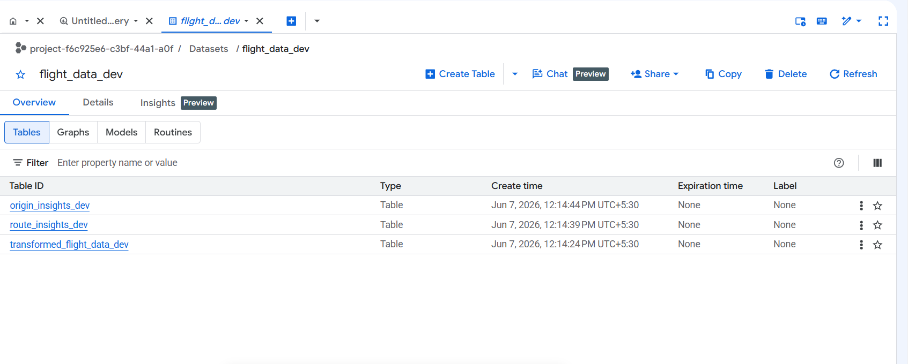

# Flight Booking Pipeline Demo

A demo project that uses Apache Airflow and Google Cloud Dataproc Serverless to run a PySpark job for flight booking analytics.

## Overview

This pipeline ingests flight booking data from Google Cloud Storage, transforms it with PySpark, and writes results to BigQuery.

Key components:
- Airflow DAG to detect source file arrival and submit a Dataproc Serverless batch.
- PySpark job (`spark_transformation_job.py`) to transform booking data and compute insights.
- Outputs written to BigQuery tables for transformed data, route insights, and origin insights.

## Project structure

- `airflow_job/airflow_job.py` - Airflow DAG definition and Dataproc Serverless batch submission.
- `spark_job/spark_transformation_job.py` - PySpark transformation job.

## How it works

1. Airflow `GCSObjectExistenceSensor` waits for the source CSV file in GCS.
2. When the file is present, Airflow creates a Dataproc Serverless batch job.
3. The PySpark job reads the source data from GCS, transforms it, and writes results to BigQuery.

## Configuration

The DAG reads environment settings from Airflow Variables:
- `env` (default: `dev`)
- `gcs_bucket`
- `bq_project`
- `bq_dataset`
- `tables` (JSON object containing `transformed_table`, `route_insights_table`, and `origin_insights_table`)

## Deployment

1. Upload the Spark job to the configured GCS bucket under `flight_booking_analysis/spark-job/`.
2. Deploy the Airflow DAG file to your Composer or Airflow environment.
3. Set the required Airflow Variables for your environment and BigQuery targets.
4. Trigger the DAG manually or configure a schedule.

## Run status

- Airflow variables were pushed successfully.
- DAG was created successfully.
- Task ran successfully.
- Data loaded into the `dev` BigQuery dataset.

## Screenshots

**Airflow variables created**

The required Airflow Variables were successfully pushed for the `dev` environment.

---

**DAG created**

The `flight_booking_dataproc_bq_dag` is deployed and visible in the Airflow UI.

---

**Airflow run**

The DAG run completed successfully and the Spark job execution is visible in Airflow.

---

**BigQuery data available**

The output tables are present and data is available in the `dev` BigQuery dataset.

## Notes

>The batch is configured for Dataproc Serverless version `2.2`.
> The Spark job writes data to BigQuery using the BigQuery connector.
> Adjust CPU and memory settings in `airflow_job.py` if you need to match your GCP quota.

> Google Cloud Composer has been deleted for this demo, so the pipeline will not run in the current environment until Composer is reconfigured.
> Composer is expensive to keep running, so please configure it as needed for your next execution.
> In the future, this pipeline will be made dynamic to accept GCP details as variables.